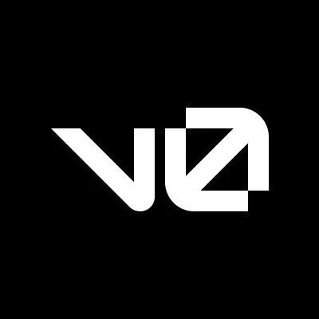
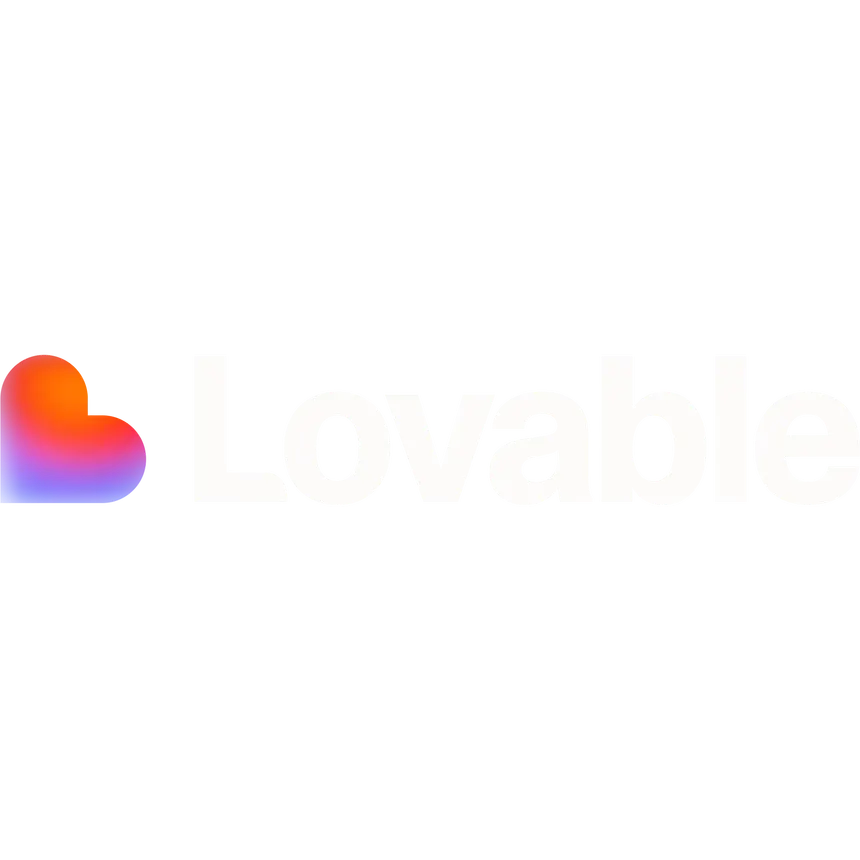
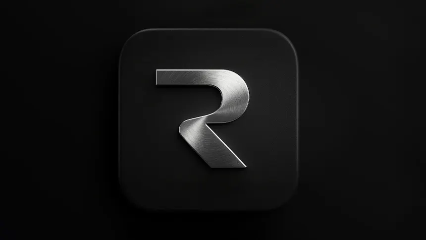
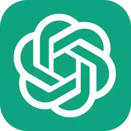
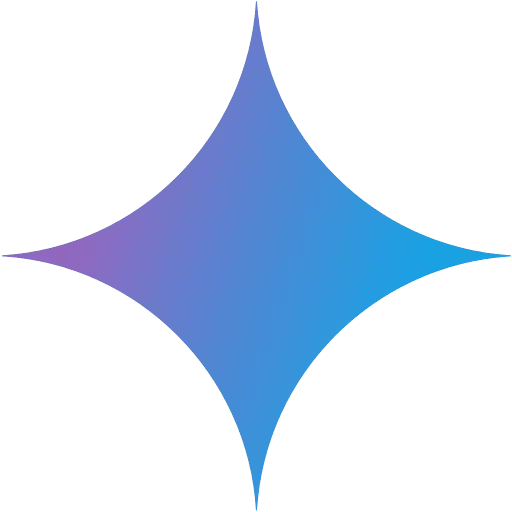
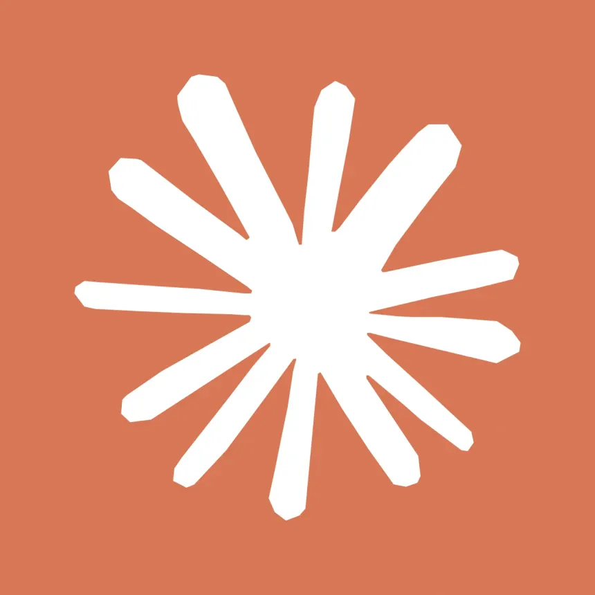

---

## < Sobre />

Sou **João Batista**, desenvolvedor front-end em formação, atualmente no 4º período de Análise e Desenvolvimento de Sistemas no **Centro Universitário UNIFAFIRE**, com formação técnica em TI pelo Senac.

Tenho grande interesse em **desenvolvimento de interfaces e experiência do usuário**, buscando criar aplicações que unam funcionalidade, clareza visual e usabilidade. Também possuo afinidade com design de interfaces e prototipação, o que contribui para uma visão mais estratégica na construção de produtos digitais.

Além do desenvolvimento, sou criador do projeto **Frontista**, perfil onde compartilho minha evolução na área da tecnologia, estudos, projetos, processos criativos e minha trajetória, usando as redes sociais como forma de documentar aprendizado, trocar conhecimento e inspirar outras pessoas que também estão construindo seu caminho na programação.

Participei de projetos acadêmicos e colaborativos que fortaleceram minhas habilidades em trabalho em equipe, organização, comunicação e resolução de problemas. Busco constantemente evoluir profissionalmente, aprendendo novas tecnologias e desenvolvendo soluções cada vez mais eficientes e bem estruturadas.

Paulista, PE 📍

---

## < Portfólio />

*Todos os projetos reunidos, com o detalhe técnico de cada um.*

---

## < Habilidades />

 

<table>
  <tr>
    <th>💻 Linguagens</th>
    <th>🎨 Front-end</th>
    <th>⚙️ Back-end</th>
    <th>🗄️ Databases</th>
  </tr>
  <tr>
    <td align="center" valign="top">
      
    </td>
    <td align="center" valign="top">
      
    </td>
    <td align="center" valign="top">
      
    </td>
    <td align="center" valign="top">
      
    </td>
  </tr>
</table>

 

<table>
  <tr>
    <th>📐 Prototipação</th>
    <th>🚀 Deploy & Tools</th>
    <th>📩 Mensageria & APIs</th>
    <th>🤖 IA & Produtividade</th>
  </tr>
  <tr>
    <td align="center" valign="top">
      
       
      
      
    </td>
    <td align="center" valign="top">
      
    </td>
    <td align="center" valign="top">
      
    </td>
    <td align="center" valign="top">
      
      
      
    </td>
  </tr>
</table>

 

🇧🇷 Português · Nativo &nbsp;&nbsp;|&nbsp;&nbsp; 🇺🇸 Inglês · B1 &nbsp;&nbsp;|&nbsp;&nbsp; 🇪🇸 Espanhol · Intermediário

---

## < Projetos />

Do mais recente pro mais antigo.

 

<table width="100%">
  <tr>
    <td align="center">
      
    </td>
  </tr>
  <tr>
    <td>
      <b>💰 Despevit</b>
        
      Gestão e planejamento financeiro pessoal: contas, cartões, metas e previsão de compras num lugar só.
        
      🚧 <b>Em construção</b> &nbsp;|&nbsp; <b>Papel:</b> Desenvolvedor Full-stack (solo) &nbsp;|&nbsp; <b>Período:</b> Set 2026 até o momento
        
      
        
      
        
      ainda sem demo, código em construção
    </td>
  </tr>
</table>

 

<table width="100%">
  <tr>
    <td align="center">
      
    </td>
  </tr>
  <tr>
    <td>
      <b>💈 Kairos</b>
        
      Agendamento para barbearias: cliente marca pelo link, barbeiro acompanha tudo no painel, com confirmação e lembrete automáticos por e-mail.
        
      <b>Papel:</b> Desenvolvedor Full-stack (solo) &nbsp;|&nbsp; <b>Período:</b> Jun a Set 2026
        
      
        
      
      
    </td>
  </tr>
</table>

 

<table width="100%">
  <tr>
    <td align="center">
      
    </td>
  </tr>
  <tr>
    <td>
      <b>📚 Praxis</b>
        
      Gestão do conhecimento corporativo: documentos, procedimentos e avisos da equipe num lugar só, com acesso por cargo.
        
      <b>Papel:</b> Desenvolvedor Full-stack (solo) &nbsp;|&nbsp; <b>Período:</b> Mai a Jul 2026
        
      
        
      
      
    </td>
  </tr>
</table>

 

<table width="100%">
  <tr>
    <td align="center">
      
    </td>
  </tr>
  <tr>
    <td>
      <b>🌉 P.O.N.T.E</b>
        
      Conecta jovens talentos do Nordeste a oportunidades reais, com o Manguelito, um assistente de IA que identifica habilidades a partir de conversas.
        
      🥇 <b>1º Lugar</b> &nbsp;|&nbsp; <b>Papel:</b> Front-end Lead & Scrum Master &nbsp;|&nbsp; <b>Período:</b> Jan 2026 até o momento
        
      
        
      
      
    </td>
  </tr>
</table>

 

<table width="100%">
  <tr>
    <td align="center">
      
    </td>
  </tr>
  <tr>
    <td>
      <b>🤝 Benevo</b>
        
      Gestão de doações para ONGs: controle de estoque, recebimento e distribuição de itens para beneficiários.
        
      🥈 <b>2º Lugar</b> &nbsp;|&nbsp; <b>Papel:</b> Front-end Lead & Scrum Master &nbsp;|&nbsp; <b>Período:</b> Jul a Dez 2025
        
      
        
      
      
    </td>
  </tr>
</table>

 

<table width="100%">
  <tr>
    <td align="center">
      
    </td>
  </tr>
  <tr>
    <td>
      <b>🦠 Limpattack</b>
        
      Jogo inspirado na franquia Pokémon pra ensinar higiene e combate a bactérias pra crianças de 6 a 10 anos.
        
      🥇 <b>1º Lugar</b> &nbsp;|&nbsp; <b>Papel:</b> Desenvolvedor & Editor do Trailer &nbsp;|&nbsp; <b>Período:</b> Fev a Jun 2025
        
      
        
      
      
    </td>
  </tr>
</table>

---

